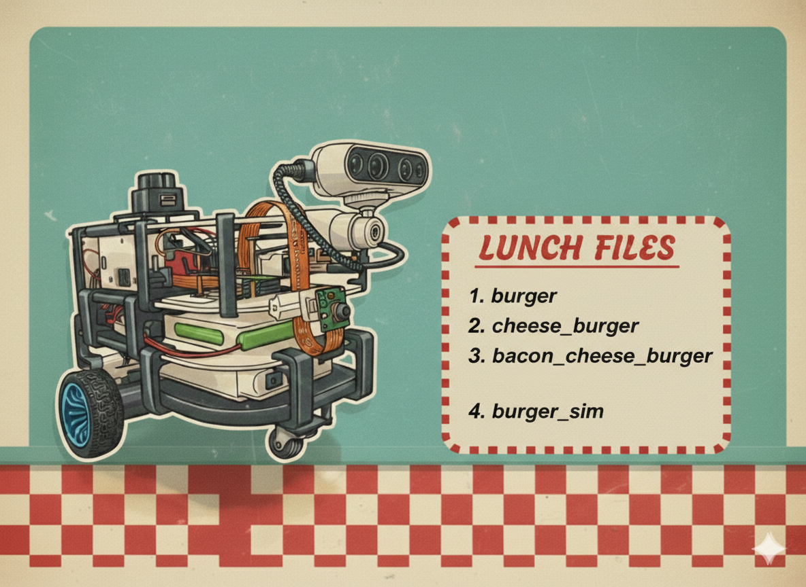
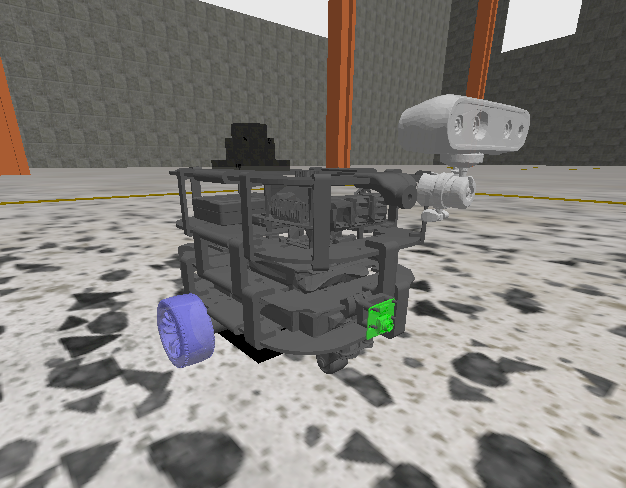
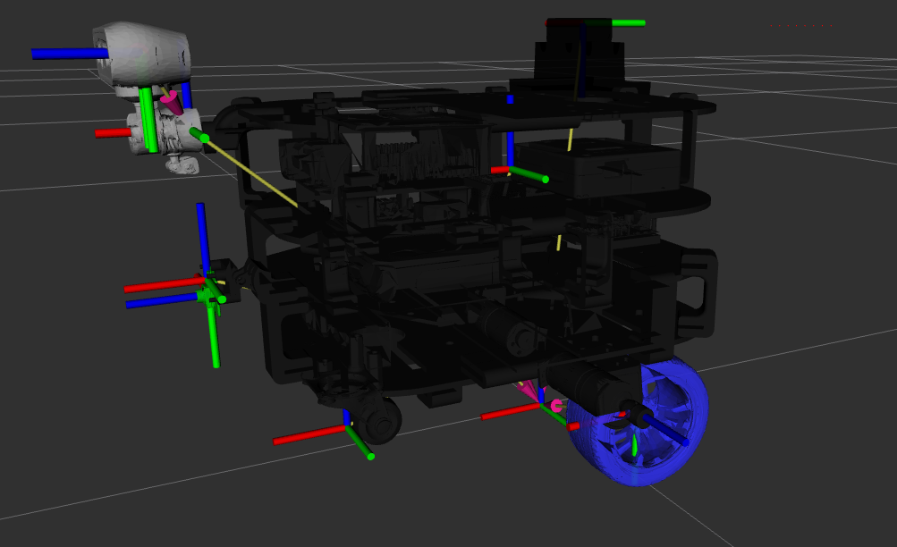

# BURGER – Unicycle Mobile Robot Platform

BURGER is a modular unicycle mobile robot platform designed for research and development in embedded control, perception, and autonomous navigation. The system combines a high-level ROS 2 computing unit with a real-time microcontroller-based motor control layer and multiple perception sensors.

The platform is structured to support both real-world deployment and full simulation in Gazebo (GZ Sim).
---

---

# 1. System Overview

## 1.1 Hardware Architecture

**High-Level Computation:**

* Raspberry Pi 5
* Debian
* ROS 2 Humble

**Real-Time Control:**

* STM32 Nucleo F303RE
* Deterministic motor control loop
* Encoder acquisition
* IMU acquisition
* Serial ommunication 

**Sensors:**

* LD06 2D LiDAR
* Intel RealSense D435i (RGB + Depth)
* Raspberry Pi Camera Module 3 Wide (RGB wide FOV)
* IMU bno085

The Raspberry Pi handles perception, localization, teleoperation, and high-level control. The STM32 executes low-level motor control and encoder processing.

---

# 2. Software Architecture

The project follows a standard ROS 2 workspace structure.

```
BURGER/
├── src/
│   ├── robot_descriptor/
│   ├── stm32_nucleo_f303re_driver/
│   ├── lidar_driver/
│   ├── joy_service_node/
│   ├── joy_teleop_twist_ref/
│   ├── realsense-ros/
│
├── config/
├── Dockerfile
├── docker-compose.yml
├── .devcontainer/
```

## Main ROS 2 packages:

**robot_descriptor**

* URDF / Xacro robot model
* TF tree
* Gazebo integration
* Simulation launch files

**stm32_nucleo_f303re_driver**

* Communication with STM32
* Velocity command transmission
* Encoder feedback reception
* Odometry publishing
* IMU publishing

**lidar_driver**

* LD06 communication
* LaserScan publishing

**joy_service_node**

* Arm/disarm
* micro reset

**joy_teleop_twist_ref**

* Joystick mapping
* Velocity reference generation (cmd/vel)

---

# 3. Dependencies

## 3.1 System Dependencies

* Ubuntu 22.04 (recommended)
* ROS 2 Humble
* colcon
* Python 3.10+
* CMake

**Optional (for perception stack):**

* Intel RealSense SDK 2.x
* librealsense

**Simulation:**

* ros_gz_sim
* ros_gz_bridge
* Gazebo (GZ Sim)
* RViz2

---
# 4. Docker-Based Development

The repository includes a Dockerfile and DevContainer configuration for reproducible development.

* Open project in VSCode
* Select "Reopen in Container"

The container provides:

* ROS 2 Humble
* Host networking
* Device passthrough (joystick, USB devices)

---
# 5. Quick Start
## 5.1 Clone the Repository

Create a ROS 2 workspace and clone the repository:

```
mkdir -p ~/burger_ws/src
cd ~/burger_ws/src
git clone <REPOSITORY_URL>
cd ..
code .
```
## 5.2 build and run the container
  `Ctrl` + `Shift` + `P`
* build and open in Container

## 5.3 Build the Workspace

```
colcon build
source install/setup.bash
```

---

# 6. Running the Robot

## 6.1 Real Robot

Ensure:

* STM32 is flashed and connected
* LiDAR is connected
* Cameras are connected
* Joystick is available (if teleoperation is required)

Launch full stack:

```
ros2 launch stm32_nucleo_f303re_driver burger_launch.py (without lidar and camera)

ros2 launch stm32_nucleo_f303re_driver cheese_burger_launch.py (with lidar)

ros2 launch stm32_nucleo_f303re_driver becon_cheese_burger_launch.py (with lidar and camera)
```

This will start:

* STM32 driver
* LiDAR driver
* Joystick nodes
* Teleoperation mapping
* Robot state publisher

topic list
``` bash
/burger/realsense/depth/camera_info
/burger/realsense/depth/image_rect_raw
/burger/realsense/depth/metadata
/cmd_vel
/enc/twist_meas
/enc/twist_wheels
/imu
/joint_states
/joy
/joy/cmd_vel
/joy/set_feedback
/magnetometer
/parameter_events
/robot_description
/robot_status/is_armed
/rosout
/scan
/tf
/tf_static
```
---

## 6.2 Simulation
---

---
Run Gazebo simulation:

```
ros2 launch robot_descriptor simulation.launch.py use_sim_camera:=true
```

Simulation includes:

* Robot spawning
* ros_gz_bridge
* TF tree publication
* RViz visualization
* Optional simulated camera

---

topic list
``` bash
/camera/rgb/camera_info
/camera/rgb/image_raw
/camera/rgbd/camera_info
/camera/rgbd/image_raw
/clock
/cmd_vel
/imu
/joint_states
/joy
/joy/cmd_vel
/joy/set_feedback
/odom
/parameter_events
/robot_description
/rosout
/scan
/tf
/tf_static
```

# 7. Data Flow

Control Flow:

Joystick → joy_node → teleop_twist_joy → joy_vel_ref → stm_driver → STM32 → ln298n → Motors
Encoders → STM32 → stm_driver → ROS 2

Perception Flow:

LD06 → lidar_driver → /scan
RealSense → image / depth 
Camera Module 3 → RGB stream

---

# 8. TF Tree Structure 
## 8.1. Simulation


```
odom
 └── base_footprint
      └── base_link
           ├── chassis
           ├── left_wheel
           ├── right_wheel
           ├── caster_wheel
           ├── laser_frame
           ├── imu
           ├── camera_depth_link
           │     └── camera_depth_optical_frame
           ├── camera_rgb_link
           │     └── camera_rgb_optical_link
           └── camera_color_optical_frame
```

---

# 9. Design Principles

* Separation of high-level intelligence and real-time control
* Deterministic embedded motor control
* Modular ROS 2 architecture
* Reproducible containerized environment
* Simulation-first development workflow

---

# 10. Future Extensions

* Extended Kalman Filter (encoders + IMU)

---

# Author

Emanuele Donato
